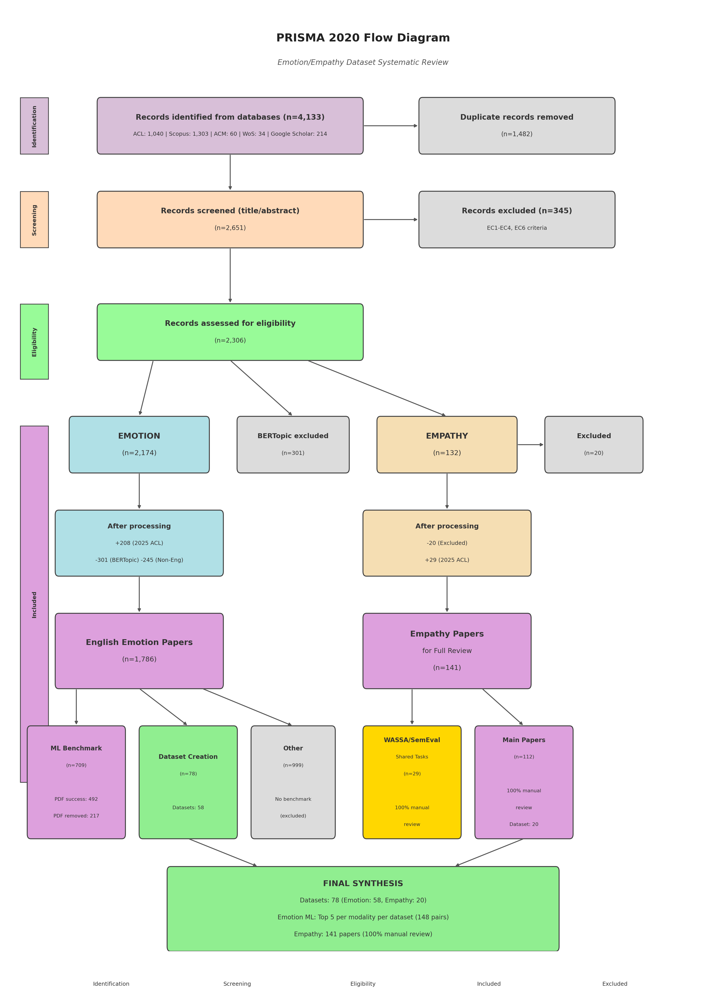

# Emopathy: A Systematic Review of Emotion and Empathy Recognition

> **"I do not ask the wounded person how he feels, I myself become the wounded person."**
> – Walt Whitman, *Song of Myself*

---

## Overview

This repository accompanies a systematic review of emotion and empathy recognition in NLP/AI. We provide the scripts used to collect, filter, and analyze research papers, along with our methodology for identifying benchmark datasets and state-of-the-art models.

**Key Findings:**
- **78 Benchmark Datasets**: 58 Emotion + 20 Empathy
- **Emotion Recognition**: 148 top paper-modality pairs (Top 5 per modality per dataset)
- **Empathy Recognition**: 141 papers (100% manual review)

---

## PRISMA Flow



| Stage | Count |
|-------|-------|
| Identified | 4,133 |
| After Duplicates Removed | 2,651 |
| Eligibility Assessment | 2,306 |
| EMOTION papers | 2,174 |
| EMPATHY papers | 132 (+29 from ACL 2025) |
| Final Datasets | 78 (58 Emotion + 20 Empathy) |

---

## Methodology

### 1. Database Search
Sources: **Scopus**, **Web of Science**, **ProQuest**, **ACM**, **Google Scholar**, **ACL Anthology**

### 2. Boolean Filtering
Advanced search queries for papers published after 2014. See [`boolean-search/`](boolean-search/) for query scripts.

### 3. Topic Modeling (BERTopic)
Used Sentence-BERT embeddings + clustering to classify papers into ML benchmark vs. other categories.

### 4. Manual Screening
- **EMOTION**: Top 5 papers per modality per dataset (based on field-appropriate metrics)
- **EMPATHY**: 100% manual review of all 141 papers
- **Shared Tasks** (WASSA, SemEval): Analyzed separately (29 papers)

---

## Repository Structure

```
├── scripts/
│   ├── filtering/           # Paper filtering scripts
│   ├── topic_modeling/      # BERTopic classification
│   ├── extraction/          # PDF → structured data extraction
│   ├── download/            # Paper download utilities
│   └── visualization/       # PRISMA diagram, statistics
│
├── boolean-search/          # Database search queries
├── statistics/              # Analysis results
│
├── requirements.txt
└── README.md
```

---

## Scripts Overview

### Filtering (`scripts/filtering/`)
| Script | Description |
|--------|-------------|
| `emotion_filtering.py` | Filter emotion-related papers from search results |
| `empathy_detailed_filtering.py` | Detailed empathy paper classification |

### Topic Modeling (`scripts/topic_modeling/`)
| Script | Description |
|--------|-------------|
| `topic_modeling_sbert.py` | Sentence-BERT + KMeans clustering |
| `run_topic_modeling.py` | BERTopic pipeline execution |

### Extraction (`scripts/extraction/`)
| Script | Description |
|--------|-------------|
| `extract_from_pdfs.py` | Extract ML benchmark info from PDFs (Claude API) |
| `extract_dataset_info.py` | Extract dataset metadata |
| `extract_top5_modality_papers.py` | Select top 5 papers per modality per dataset |

### Visualization (`scripts/visualization/`)
| Script | Description |
|--------|-------------|
| `create_prisma_diagram.py` | Generate PRISMA 2020 flow diagram |
| `db_statistics.py` | Database statistics and charts |

---

## Modality-Specific Metrics

For ranking papers, we use field-appropriate metrics:

| Modality | Primary Metric |
|----------|---------------|
| Physio, Audio, Video | Accuracy |
| Text, Multimodal (T+A, T+V, T+A+V) | F1-weighted |

---

## Installation

```bash
git clone https://github.com/philhelenina/Emopathy-Dataset-Review.git
cd Emopathy-Dataset-Review
pip install -r requirements.txt
```

**Note**: Some extraction scripts require an Anthropic API key. Set it in a `.env` file:
```
ANTHROPIC_API_KEY=your_key_here
```

---

## Citation

If you use this repository, please cite our paper (forthcoming).

---

## License

MIT License
